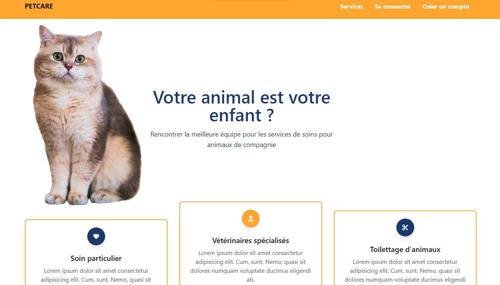

# Petcare

Petcare is a web application that allows pet owners to easily find and book pet care services for their furry friends.  
This project was developed using Angular and NestJs, here's a link to the [backend](https://github.com/safa-abidi/petcare_back/).  

  

## Installation & Usage
- Clone the project 
- Install dependencies by running ``npm install``  
- Start the application by running ``ng serve``
